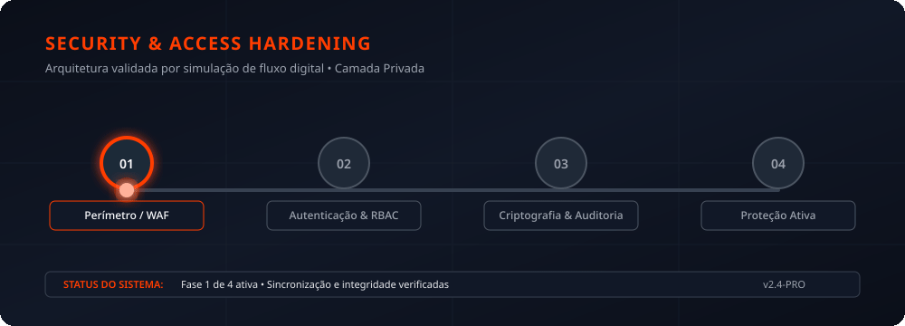

# Black & White IT


<p align="center">
  
</p>

<p align="center"><strong>Projeto de presença digital para serviços de sites, sistemas e suporte técnico recorrente.</strong></p>

## Visão geral

Este repositório contém o site institucional da Black & White IT, com uma proposta de serviços digitais por assinatura. O código concentra uma landing page responsiva, informações de planos, explicação de serviços e caminhos de contato.

## Tecnologias

`HTML` · `CSS` · `JavaScript`

## Executar localmente

```bash
git clone https://github.com/LEVIATAD21/blackandwhite-it.git
cd blackandwhite-it
python3 -m http.server 8080
```

Abra `http://localhost:8080` no navegador.

## Transparência de conteúdo

Depoimentos e resultados comerciais devem ser publicados somente quando forem verificáveis e autorizados pelas pessoas ou empresas mencionadas.
